```{r setup, include=FALSE}
knitr::opts_chunk$set(
  echo = TRUE, 
  message = FALSE, 
  warning = FALSE,
  error = FALSE,
  fig.align = 'center',
  out.width='60%')
```

```{r, include=FALSE}
library(readxl)
library(tidyverse)
library(tidytext)
library(wordcloud)
library(patchwork)
library(countdown)
library(flair)
```

# Introducción

## Algunos acuerdos

- Cámaras abiertas cuando sea posible (y si el internet lo permite)
- Micrófonos cerrados 
  * Chat de Zoom 
  * Habrán espacios para intervenciones
- 3 bloques
    * Introducción al Machine Learning
    * Ejemplos aplicados de Machine Learning
    * Resolviendo problemas con Machine Learning

## Presentación

- **Claudio Aracena - claudio.aracena@uai.cl**
  * Ingeniero Civil Industrial (U. de Chile) 
  * Master of Information Technology (U. of Sydney)
  * Científico de datos - GobLab UAI
  * Co-fundador Chatbot Chile


## ¿Qué veremos hoy?

1. Introducción a Machine Learning
2. 

# Introducción a Machine Learning

## Machine Learning

<div style="float: left; width: 50%;">

**Arthur Samuel (1959)**: Disciplina que estudia la habilidad de aprendizaje de computadores sin haber sido explícitamente programado.

**Tom Mitchell (1998)**: Se dice que un programa computacional aprende de la experiencia E respecto a una tarea T y con una métrica de rendimiento M, si el rendimiento en T, medido por M, mejora con la experiencia E. 

</div>

<div style="float: left; width: 50%;">

```{r, echo = FALSE, out.width='250px'}
knitr::include_graphics("Imagenes/Arthur_Samuel.jpg")
```

</div>

## Inteligencia Artificial, Machine Learning y Deep Learning

```{r, echo = FALSE, out.width='600px'}
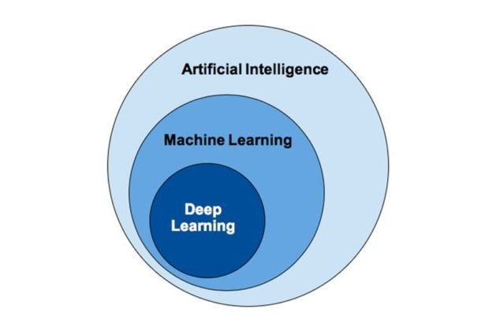
```

## Machine Learning

```{r, echo = FALSE, out.width='600px'}
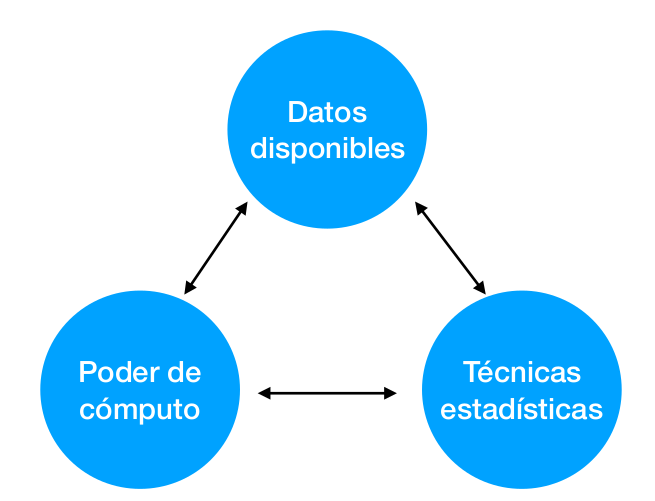
```

## Casos de éxito 

- ML funciona mejor cuando aumenta el conocimiento especializado de un experto
  * Medicina → Cáncer, reconocimiento de imágenes
  * Políticas públicas → predicción de riesgo (delitos, violencia, etc.)
  * Fiscalización → detección de fraude 
  * Manufactura → predicción de fallas y de mantención
  * Agricultura → predicción de heladas, riego y aplicado de pesticida
  * Comercio → Segmentación de clientes
  
## Límites de Machine Learning

- No es un sustituto para un cerebro humano
- No tiene flexibilidad
- No tiene sentido común
- Hay que identificar qué aprendió un algoritmo antes de aplicarlo
- Consideraciones éticas

## Aprendizaje 

- Una máquina aprende cuando utiliza experiencia (datos) para mejorar su desempeño en tarea específica con respecto a una métrica

- 4 pasos del aprendizaje:
  * Almacenamiento de datos
  * Abstracción
  * Generalización
  * Evaluación

## Aprendizaje 

```{r, echo = FALSE, out.width='900px'}
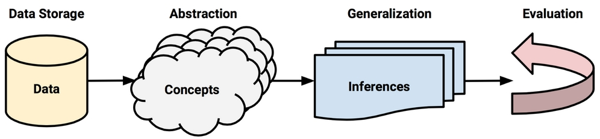
```


## Almacenamiento de datos

<div style="float: left; width: 50%;">

- ¿Qué guardar?
- ¿Cuánto guardar?

</div>

<div style="float: left; width: 50%;">

```{r, echo = FALSE, out.width='200px'}

```

</div>


## Abstracción 

<div style="float: left; width: 50%;">

- Asignarle sentido a los datos
- Elección de un modelo
  * Ecuaciones
  * Diagramas de relación (árboles/grafos)
  * Reglas lógicas
  * Agrupamientos
- Entrenamiento de un modelo

</div>

<div style="float: left; width: 50%;">

```{r, echo = FALSE, out.width='400px'}
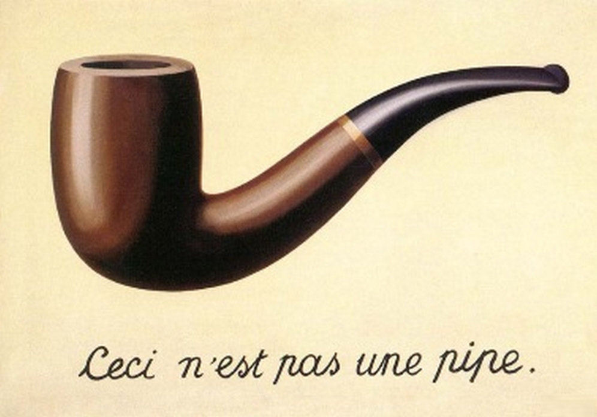
```

</div>

## Generalización

- Convertir conocimiento abstraído a una forma que sea utilizable para informar acciones futuras
- Aplicación del modelo para hacer predicciones sobre nuevos datos
- Puede presentar bias

```{r, echo = FALSE, out.width='900px'}
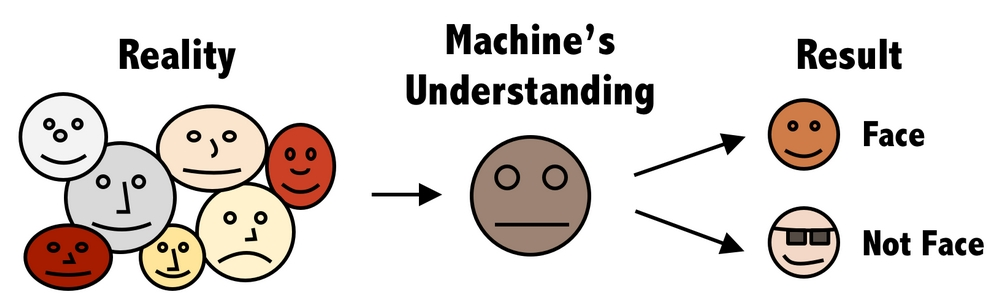
```

## Evaluación

- Todo aprendizaje tiene debilidades
- Determinar la calidad del modelo generado
- Evitar sobreajuste (overfitting)

```{r, echo = FALSE, out.width='700px'}
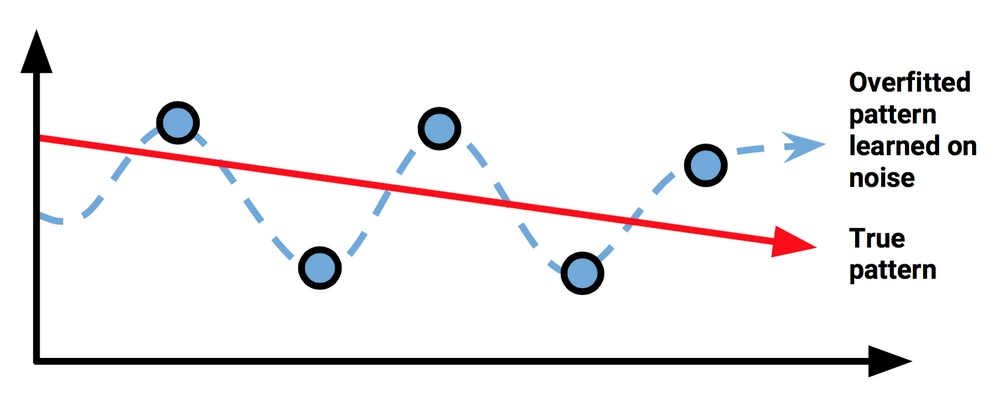
```


## Pasos prácticos

- Recolección de datos
- Exploración y preparación de datos*
- Entrenamiento del modelo
- Evaluación del modelo
- Refinamiento del modelo*

*Feature Engineering: proceso de extraer features a partir del conocimiento experto 

## Tipos de datos

- Numéricos
  * Ingreso hogar en $, temperatura en °C
- Categóricos
  *  empleado o desempleado, Nacionalidad
- Ordinales 
  * NSE (Bajo, Medio, Alto)
  
## Features y ejemplos

- Features: características, variables, columnas, etc.
- Ejemplos: observaciones, filas, etc.  

```{r, echo = FALSE, out.width='800px'}
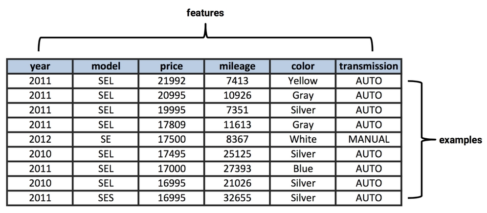
```


## Tipos de aprendizaje

- **Aprendizaje supervisado**: Aprendizaje basado en un conjunto de datos de entrenamiento para predecir/clasificar una variable objetivo.

- **Aprendizaje no supervisado**: Aprendizaje donde un modelo se ajusta a las observaciones sin variable objetivo. Utilizado para agrupar, asociar o detectar anomalías.

- **Aprendizaje reforzado**: Aprendizaje donde un agente decide curso de acciones basado en maximización de recompensa.

## Tipos de aprendizaje

<div style="float: left; width: 50%;">

**Aprendizaje supervisado**

- Regresiones
  * Regresión lineal 
  * Árbol de regresión
- Clasificaciones
  * K-Nearest Neighbors
  * Naive Bayes
  * Árbol de decisión 
  * Redes neuronales*
  * Support Vector Machine*

</div>

<div style="float: left; width: 50%;">

**Aprendizaje no supervisado**

- Agrupamiento
  * K-means clustering
  * Reglas de asociación
- Detección de anomalías
  * Distribución normal
</div>

## Break

```{r, echo = FALSE}
knitr::include_url("https://apps.garrickadenbuie.com/countdown/")
```

# K-Nearest Neighbors

## Test del perro

<div style="float: left; width: 50%;">

Si parece perro, ladra como perro, corre como perro, entonces probablemente sea un perro

</div>

<div style="float: left; width: 50%;">

```{r, echo = FALSE, out.width='400px'}
knitr::include_graphics("Imagenes/perro.jpg")
```

</div>

## K-Nearest Neighbors

- Clasificador basado en los vecinos mas cercanos

1. Buscamos los k vecinos mas cercanos a un ejemplo a clasificar
2. Le asignamos la clase mas común de los vecinos a ese ejemplo

- El k debe ser impar para evitar empates

## Clasificando comidas

```{r, echo = FALSE, out.width='700px'}
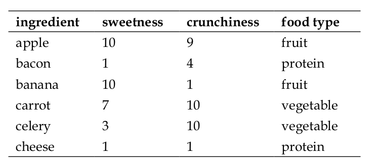
```

## Clasificando comidas

```{r, echo = FALSE, out.width='500px'}
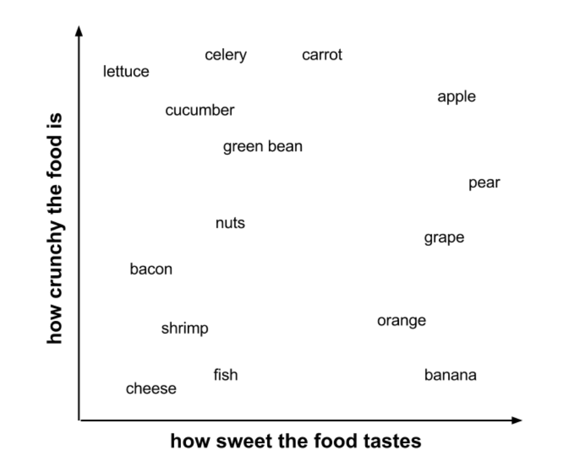
```

## Clasificando comidas

```{r, echo = FALSE, out.width='500px'}
knitr::include_graphics("Imagenes/food3.png")
```

## Clasificando comidas

```{r, echo = FALSE, out.width='500px'}
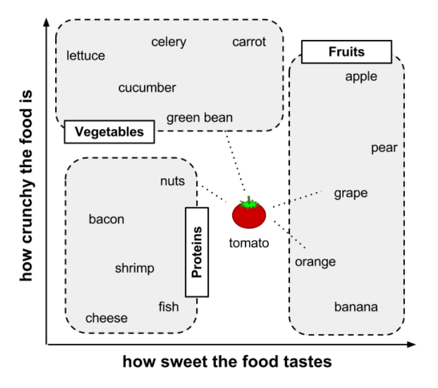
```

## Calculando distancias

- Distancia Euclidiana 

$$ dist(x, y) = \sqrt{(x_{1}-y_{1})^2 + (x_{2}-y_{2})^2 + ... + (x_{n}-y_{n})^2}  $$

- Distancia Manhattan 

$$ dist(x, y) = (x_{1}-y_{1}) + (x_{2}-y_{2}) + ... + (x_{n}-y_{n})  $$

## Clasificando comidas

- tomato (sweetness = 6, crunchiness = 4)

```{r, echo = FALSE, out.width='800px'}
knitr::include_graphics("Imagenes/food5.png")
```

## Decidiendo el $k$

```{r, echo = FALSE, out.width='800px'}
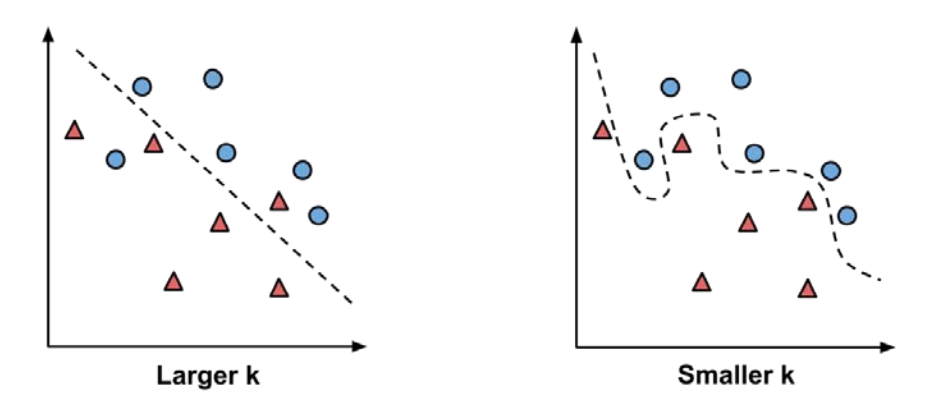
```

## Normalización de datos

- Normalización: significa ajustar los valores medidos en diferentes escalas respecto a una escala común 
- ¿Por qué es necesario normalizar?
- Normalización min-max:
$$ z_{i} = \frac{x_{i}-min(x)}{max(x)-min(x)}  $$
- Normalización z-score (función $scale$):
$$ z_{i} = \frac{x_{i}-\overline{x}}{\sigma}  $$

## Conjunto de entrenamiento y prueba

- Conocidos en inglés como conjuntos (sets) de training y test
- No podemos entrenar y probar el modelo con el mismo conjunto de datos
- Se suele separar un conjunto aleatorio de datos para probar (evaluar) los resultados del modelo
- El resto de los datos son usados para entrenar
- Una separación común es 30% para el conjunto de prueba y 70% para el conjunto de entrenamiento

## Diagnosticando cáncer

- Descripción dataset : https://archive.ics.uci.edu/ml/datasets/Breast+Cancer+Wisconsin+(Diagnostic)

- Descargar dataset: https://github.com/stedy/Machine-Learning-with-R-datasets/blob/master/wisc_bc_data.csv

## K-Nearest Neighbors

<div style="float: left; width: 50%;">

- Ventajas
  * Simple y efectivo
  * No se asume nada sobre los datos
  * No hay entrenamiento

</div>

<div style="float: left; width: 50%;">

- Desventajas
  * No se genera un modelo 
  * Sensible al valor del $k$
  * Etapa de clasificación lenta
  * Requiere mucha memoria

</div>

## Break

```{r, echo = FALSE}
knitr::include_url("https://apps.garrickadenbuie.com/countdown/")
```

# Naive Bayes

## Probabilidad e Independencia

- Se define la probabilidad conjunta como: $$ P(A \cap B) = P(B|A) * P(A)  $$
- Si $A$ y $B$ son independientes, entonces 
  $$ P(B|A) = P(B)  $$
  $$ P(A \cap B) = P(B) * P(A)  $$

## Teorema de Bayes

```{r, echo = FALSE, out.width='700px'}
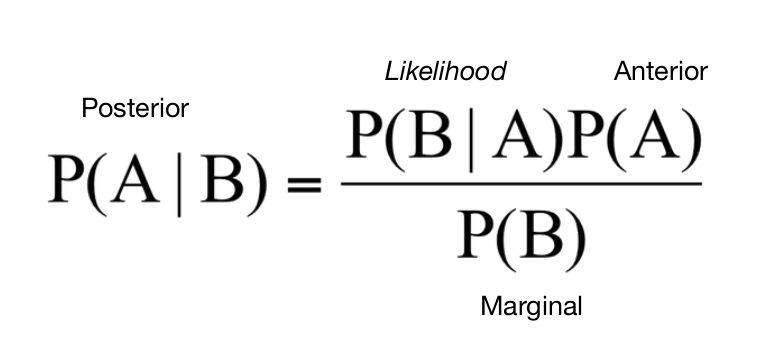
```

## Detección de Spam

- Al analizar los emails de una empresa se encuentra que:
  * 20% de emails son spam

```{r, echo = FALSE, out.width='400px'}
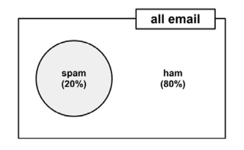
```

## Detección de Spam

- Al analizar los emails de una empresa se encuentra que:
  * 20% de emails son spam
  * 5% de emails contienen la palabra "Viagra"

```{r, echo = FALSE, out.width='400px'}
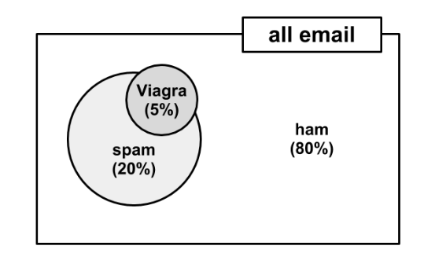
```

## Detección de Spam

- Si asuminos independencia
$$ P(spam \cap Viagra) = P(spam) * P(Viagra) =  0.2 * 0.05 = 0.01 $$
```{r, echo = FALSE, out.width='400px'}
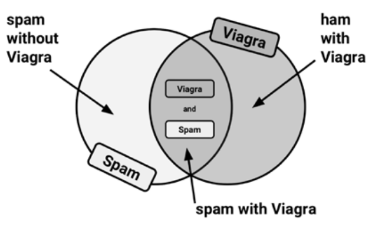
```

## Detección de Spam

- Pero sabemos que ambos eventos son dependientes

```{r, echo = FALSE, out.width='800px'}
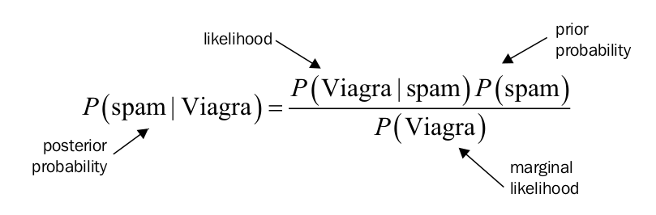
```

## Detección de Spam

```{r, echo = FALSE, out.width='800px'}
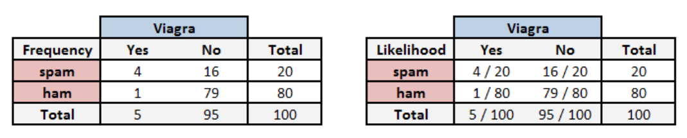
```

- Calculando la probabilidad conjunta se obtiene:
$$  P(spam \cap Viagra) = P(Viagra|spam) *  P(spam) = \frac{4}{20} *  \frac{20}{100} = 0.04  $$
- 4 veces mas grande que asumiendo independencia

## Detección de Spam

- Utilizando el teorema de bayes
$$  P(spam | Viagra) = \frac{P(Viagra|spam) *  P(spam)}{P(Viagra)} = \frac{\frac{4}{20} *  \frac{20}{100}}{\frac{5}{100}} = 0.8  $$
- Es decir, hay una probabilidad del 80% que un email sea spam dado que contiene la palabra "Viagra"

## Naive Bayes

- Asumimos ingenuamente:
  * Todas las variables son igual de importantes
  * Todas las features son independientes
- A pesar de los supuestos funciona bien

$$  P(c_k|x_1,...,x_n) = \frac{P(x_1,...,x_n|c_k)*P(c_k)}{P(x_1,...,x_n)}  $$
$$ = \frac{P(x_1|c_k)*...*P(x_n|c_k)*P(c_k)}{P(x_1,...,x_n)}$$
$$ = \frac{1}{Z}P(c_k)\prod_{i=1}^{n}P(x_i|c_k)  $$

## Detección de spam

```{r, echo = FALSE, out.width='900px'}
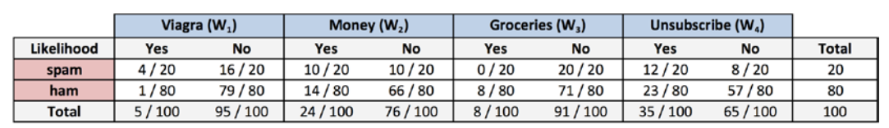
```

```{r, echo = FALSE, out.width='900px'}
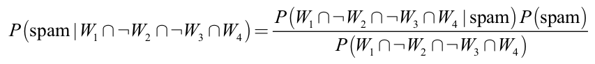
```

```{r, echo = FALSE, out.width='900px'}
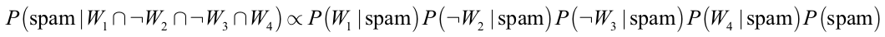
```

```{r, echo = FALSE, out.width='900px'}
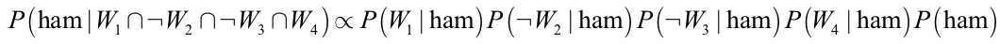
```

## Detección de spam

```{r, echo = FALSE, out.width='900px'}

```

```{r, echo = FALSE, out.width='900px'}

```

```{r, echo = FALSE, out.width='900px'}

```

```{r, echo = FALSE, out.width='900px'}
knitr::include_graphics("Imagenes/bayes11.png")
```

```{r, echo = FALSE, out.width='900px'}

```

## Naive Bayes

<div style="float: left; width: 50%;">

- Ventajas
  * Simple, rápido y efectivo
  * Tolerante a ruido y a datos faltantes
  * Requiere pocos ejemplos para entrenar
  * Fácil obtener una probabilidad para una predicción

</div>

<div style="float: left; width: 50%;">

- Desventajas
  * Asume variables igualmente importantes e independientes
  * No es ideal para datasets con muchos atributos numéricos

</div>

## Prediciendo elecciones educacionales

- Descargar dataset: https://stats.idre.ucla.edu/stat/data/hsbdemo.dta

## Resumen

- Introducción a Machine Learning
- K-Nearest Neighbors
- Naive Bayes

## Próxima clase

- Árboles de Decisión
- Evaluación

